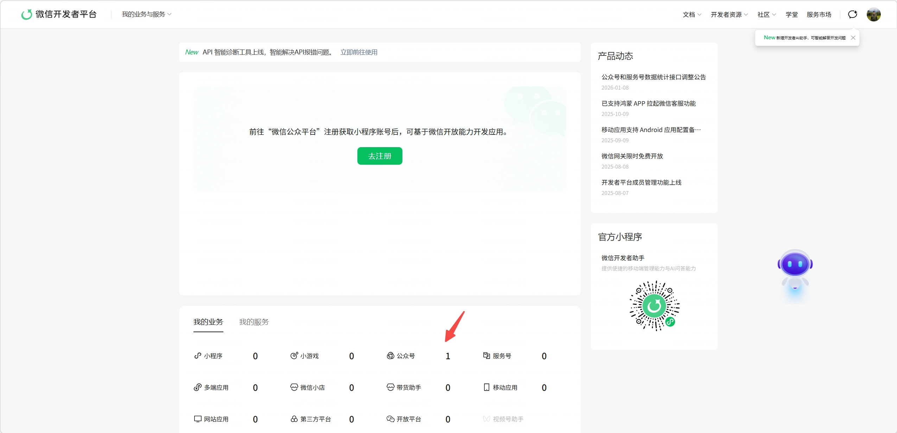
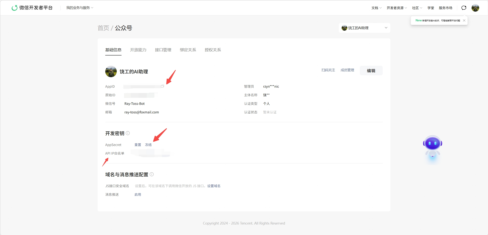

# 微信公众号发布技能（WeChat Publisher Skill）

🚀 专为OpenClaw设计的微信公众号内容生产全链路技能，从主题到草稿一键完成。

## ✨ 特性
- **🤖 完全对话式操作**：不需要运行任何命令，直接和OpenClaw对话即可完成所有操作
- **🔍 智能选题**：自动搜索热点和行业数据，推荐优质选题
- **✍️ AI内容生成**：双模式支持（技术文章/热点文章），自动生成高质量内容
- **🎨 格式优化**：自动适配微信公众号排版规范，生成标准HTML格式
- **🖼️ 智能配图**：优先搜索真实图片，自动上传到微信素材库
- **🚀 一键发布**：直接发布到公众号草稿箱，无需手动操作

## 🚀 快速开始

### 前置准备：微信公众号配置（必须先做）
在安装技能之前，请先完成微信公众号的准备工作：
1. **注册公众号**：访问 https://mp.weixin.qq.com/ 注册并认证公众号（服务号/订阅号均可）
2. **进入开发者平台**：登录微信开发者平台，在"我的业务"中点击"公众号"入口：
   
3. **获取开发者凭证**：在公众号基础信息页面，获取 `AppID` 和 `AppSecret`，并配置IP白名单：
   
4. **配置IP白名单**：在同一个页面，将运行OpenClaw的服务器公网IP添加到IP白名单中
5. **开通接口权限**：确保公众号拥有素材管理、草稿箱管理等接口权限

### 1. 安装技能
#### 方式一：一键安装（推荐）
```bash
# 直接运行此命令即可完成安装
bash <(curl -fsSL https://raw.githubusercontent.com/Ray-Toss/wechat-publisher-suite/main/install.sh)
```

#### 方式二：手动安装
```bash
# 克隆仓库
git clone https://github.com/Ray-Toss/wechat-publisher-suite.git

# 移动到OpenClaw技能目录
mv wechat-publisher-suite ~/.openclaw/workspace/skills/
```

### 2. 配置环境变量
在OpenClaw的环境变量中添加以下配置：
```bash
# Tavily API Key - 用于搜索热点和图片
# 申请地址: https://tavily.com/
export TAVILY_API_KEY="your-tavily-api-key"

# 微信公众号配置（刚才在公众号后台获取的）
export WECHAT_APPID="你的公众号AppID"
export WECHAT_APPSECRET="你的公众号AppSecret"
```

## 🎯 使用方式
**只需要和OpenClaw对话即可**：
```
"帮我写一篇关于智能座舱大模型应用的公众号文章"
"生成一篇关于AI大模型最新进展的技术文章，发布到公众号"
"找一下本周的科技热点，写一篇公众号文章"
"帮我把这篇Markdown文章发布到公众号草稿箱"
```

技能会自动完成所有流程：
1. 搜索相关资讯和案例
2. 生成符合公众号风格的文章内容
3. 搜索并配图，自动上传到微信素材库
4. 格式转换为微信兼容的HTML
5. 发布到公众号草稿箱
6. 返回预览链接给你审核

## 🏗️ 技能结构
```
wechat-publisher-suite/
├── SKILL.md                    # 技能定义（自动触发用）
├── README.md                   # 使用文档
├── .env.example                # 环境变量模板
├── .gitignore                  # Git忽略配置
├── LICENSE                     # MIT开源协议
├── scripts/
│   ├── content_generator.py    # 内容生成模块
│   ├── format_converter.py     # 格式转换模块
│   ├── image_processor.py      # 图片处理模块
│   └── wechat_api.py           # 微信官方API封装
├── references/
│   ├── wechat-format-spec.md   # 微信格式规范
│   └── content-templates.md    # 文章模板
└── assets/
    └── default-styles.css      # 默认排版样式
```

## 📝 支持的文章类型
### 技术文章模式
适合技术类公众号，内容结构：
- 行业背景与趋势
- 技术原理解析
- 实践案例与代码示例
- 优劣势分析
- 未来趋势展望
- 总结与互动

### 热点文章模式
适合资讯类公众号，内容结构：
- 热点事件回顾
- 多角度分析解读
- 行业影响与启示
- 观点总结与评论
- 互动提问

## 🔧 技术说明
- 基于微信公众平台官方API开发，不需要第三方转发服务
- 所有图片自动上传到微信素材库，避免外部链接失效
- 严格遵循微信公众号格式规范，生成的内容直接可用
- 内容生成由OpenClaw内置大模型自动处理，不需要额外配置OpenAI API

## 🤝 贡献
欢迎提交Issue和Pull Request！

## 📄 许可证
MIT License
